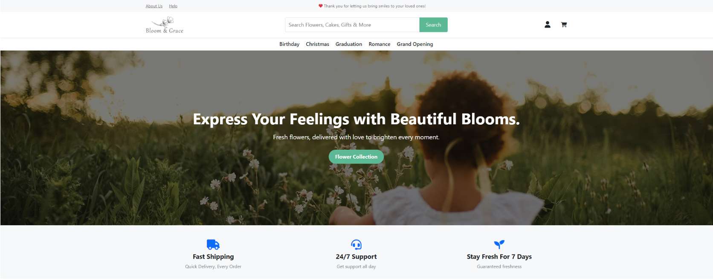

# 🌸 Bloom & Grace Flower Shop
> A comprehensive, highly secure e-commerce and back-office management platform built to modernize regional floral retail.

## About the Project
The Bloom & Grace e-commerce web application is an enterprise-grade retail platform designed to elevate the online floral shopping experience while streamlining critical back-office operations. Built to address the complex logistics of local flower delivery, it integrates a responsive, user-friendly storefront with an automated order fulfillment pipeline. Beyond the customer-facing catalog, the platform features a robust administrative Content Management System (CMS) powered by a real-time relational database backend. This end-to-end solution minimizes manual order processing, provides precise logistics tracking, and securely manages sensitive customer data and transactions.



## Tech Stack & Tools
* **Frontend / Presentation:** HTML5, CSS3, Bootstrap 5, Font Awesome, jQuery (ASP.NET Unobtrusive Validation Mapping), ASP.NET Web Form Controls
* **Backend Logic:** C# / ASP.NET Framework (v4.7.2)
* **Database Management:** Microsoft SQL Server (LocalDB) / ADO.NET (SqlConnection, SqlCommand, SqlDataReader)
* **Security & Checkout UI:** SHA-256 Cryptographic Password Hashing, Multi-Step Checkout Architecture (Curlec Gateway UI Mockup)

##  Key Features

###  Identity Management & Security Controls
* **Secure Lifecycle & RBAC:** Comprehensive guest user navigation, customer account registration, dynamic profile completion, and credential validation with strict Role-Based Access Control.
* **Brute-Force Protection:** Automated account-locking mechanism triggered after a maximum number of failed login attempts to prevent unauthorized access.
* **Self-Service Recovery:** Integrated password-recovery loop utilizing secure fallback security questions and complexity-enforced password criteria.
* **Account Settings:** Live profile dashboards for securely changing passwords, updating localized details (via input-validating state dropdowns), and handling profile image uploads.

###  Core E-Commerce Architecture
* **Discovery Engine:** Interactive product catalog featuring grid layouts, full-text search, live price matrices, and advanced multi-attribute filters (category, budget, color).
* **Smart Cart & Customization:** Granular product pages that enforce variation configurations (Size and Color) prior to checkout. Supports item modifications, dynamic shipping calculations, and delivery customizations (date, time slot, custom card greeting, sender name).
* **Adaptive Checkout:** Clean, itemized payment pages with collapsible UI elements when "Billing same as shipping address" is toggled.
* **Payment Gateways:** Secure debit/credit processing forms with Curlec API integration to safely process FPX banking, digital wallets, and cards.

### Fulfillment Analytics
* **Admin Cockpit:** Secure management panel highlighting overarching company statistics (total revenue, stock counts, active listings) and recent system activity logs.
* **Visual Progress Tracker:** Live shipping progress bar on the order tracking interface detailing fulfillment milestones, tracking codes, and timestamped courier logs (e.g., SPX Express).
* **Inventory & Order Management:** Full administrative capabilities to adjust product variations, update tracking statuses, and process pending transactions.

### CRM Tools
* **Engagement & Support:** Interactive, script-animated FAQ accordion lists and bot-protected contact sheets utilizing reCAPTCHA tokens.
* **Customer Feedback Loop:** Interactive 5-star product evaluation modal supporting media attachments and anonymous reviews to build social proof.
* **Order History:** Customer portal for tracking current orders and reviewing past purchase history.


## Setup & Installation Instructions

Follow these steps to configure and run the development environment locally:

### 1. Clone the Repository
```bash
git clone https://github.com/bitbyte0110/Flower_Shop.git
cd Flower_Shop
```

### 2. Configure the Database
The project utilizes MS SQL Server (LocalDB). The schema can be attached directly via Visual Studio or SSMS.
1. Open **SQL Server Management Studio (SSMS)**.
2. Connect to the local instance: `(LocalDB)\MSSQLLocalDB`.
3. Execute the provided SQL script (`SQLQuery1.sql`) to generate the relational schema and seed initial testing data.
4. Alternatively, attach the existing `.mdf` database files located within the `App_Data` folder.

### 3. Update Configuration Strings
Ensure the `web.config` accurately points to your local database instance:
```xml
<configuration>
  <connectionStrings>
    <add name="ProductsDB"
         connectionString="Data Source=(LocalDB)\MSSQLLocalDB;AttachDbFilename=|DataDirectory|\PRODUCTSDB.MDF;Integrated Security=True"
         providerName="System.Data.SqlClient" />
  </connectionStrings>
</configuration>
```

### 4. Build and Run
1. Open the solution file (`Assg1.sln`) in **Visual Studio**.
2. Restore all necessary dependencies (Right-click Solution -> **Restore NuGet Packages**).
3. Set the web application as the startup project.
4. Press `F5` or click **Start** to compile the C# backend and launch the application via IIS Express.
